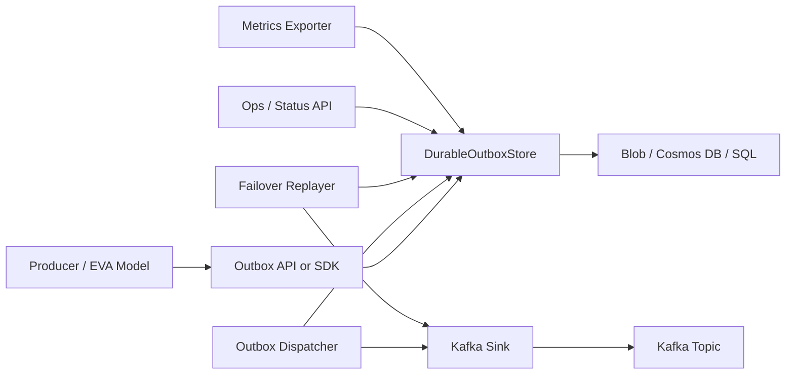
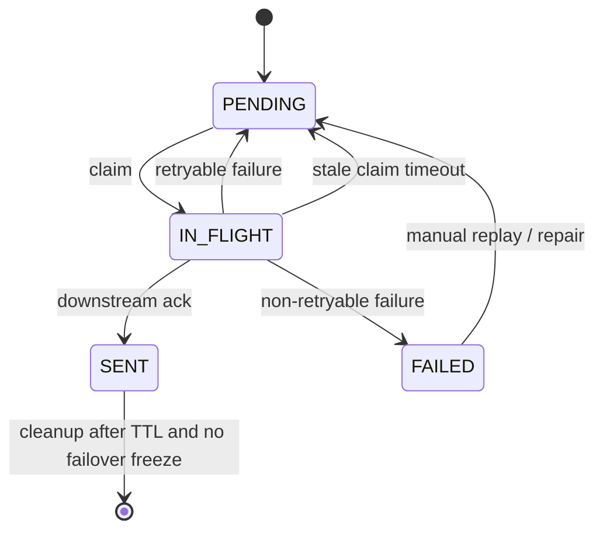

# Proposal: Reusable Durable Outbox Package for RPO=0 At-Least-Once Publishing

**Status:** Draft for planning  
**Date:** 2026-05-21  
**Target implementation language:** Python  
**Primary initial consumer:** EVA Common Kafka Publisher  
**Working package name:** `eva-durable-outbox`  
**Working service name:** `eva-common-kafka-publisher`

---

## 1. Executive summary

This proposal recommends creating a reusable Python durable outbox package that abstracts the persistence, claiming, retry, replay, cleanup, and status-management concerns required for at-least-once event publishing.

The first target use case is the EVA Common Kafka Publisher, but the package should be storage- and sink-agnostic. Kafka should be implemented as one sink. Blob, Cosmos DB, and SQL should be implemented as storage adapters.

The package should support certified **RPO=0 implementations** for accepted events using:

1. **Geo-redundant Blob**, implemented as application-level dual writes to two regional Blob accounts.
2. **Cosmos DB**, implemented using strong consistency with more than one region and a single write region.
3. **SQL**, implemented using either Azure SQL active geo-replication plus `sp_wait_for_database_copy_sync`, or SQL Server Always On synchronous-commit availability groups.

The key design principle is:

> RPO=0 is a write-acknowledgement contract, not a storage product label.

An adapter is only RPO=0 if `put(event)` returns success after the event is durably available at the adapter's documented failover durability boundary.

---

## 2. Context

The EVA Common Kafka Publisher requires durable event persistence before Kafka publication, at-least-once delivery, event-level idempotency using a producer-generated `eventId`, status visibility, retry handling, stateless publisher instances, optional per-key ordering, and operational metrics.

The reusable package generalizes those requirements so the same outbox machinery can be used with different durable stores and downstream sinks.

### Current EVA-aligned requirements

| Area | Requirement |
|---|---|
| Durable persistence | Events are persisted before publication and survive restarts, retries, and infrastructure failures. |
| At-least-once delivery | Event loss is not acceptable. Duplicate delivery is acceptable and expected. |
| Idempotency | Each event includes a unique producer-generated `eventId`. |
| Payload opacity | The publisher/outbox should not inspect or mutate business payload content. |
| Claim-check support | Kafka messages may reference large payloads stored externally, such as Blob Storage with time-bound URIs. |
| Status tracking | Events expose lifecycle state such as `PENDING`, `IN_FLIGHT`, `SENT`, and `FAILED`. |
| Stateless publisher | Publisher instances are stateless, horizontally scalable, and replayable. |
| Ordering | Optional per-key ordering is supported through ordered and unordered modes. |
| Kafka producer settings | Kafka producer uses `acks=all`; idempotent producer should be enabled. |
| Observability | Metrics are based on outbox state and publisher behavior, not only platform metrics. |
| Performance | Initial target is sustained high-throughput publishing, for example 1000 messages per minute per topic. |

---

## 3. Problem statement

The platform needs to publish events without losing accepted events when:

- Kafka is temporarily unavailable.
- The publisher process crashes or restarts.
- Multiple publisher instances run concurrently.
- Kafka acknowledges a message but the publisher crashes before recording `SENT`.
- A regional failover occurs while Kafka DR has a non-zero RPO.
- The new region needs to replay all events that were still inside the replay retention window at failover start.

Direct Kafka production does not solve the geo-failover case when Kafka replication to the DR cluster is asynchronous. A producer can receive acknowledgement from the primary Kafka cluster before the record is available in the failover Kafka cluster. To preserve at-least-once delivery across failover, the producer side needs a durable replay source covering the advertised retention window.

---

## 4. Goals

The reusable package should provide:

1. A storage-agnostic durable outbox API.
2. At-least-once publishing semantics.
3. Explicit provider capability declarations, including whether the provider is RPO=0 for accepted events.
4. Storage adapters for:
   - dual-region Blob,
   - Cosmos DB strong consistency,
   - SQL RPO=0 modes.
5. A Kafka sink implementation.
6. Failover replay based on retention TTL evaluated at failover start.
7. Cleanup freeze during failover.
8. Ordered and unordered publishing modes.
9. Common telemetry, status, and operational hooks.
10. A shared provider certification test suite.

---

## 5. Non-goals

The package will not provide:

- exactly-once end-to-end delivery,
- consumer-side deduplication logic,
- Kafka topic lifecycle management,
- Kafka cluster DR implementation,
- global ordering across all events,
- payload schema mutation,
- guaranteed RPO=0 for backends configured with asynchronous-only replication.

---

## 6. Core semantics

### 6.1 Acceptance contract

```text
put(event) success =
  the event is accepted and must eventually be published at least once,
  unless it is explicitly classified as FAILED due to a deterministic,
  non-retryable error.
```

For an RPO=0 adapter:

```text
put(event) success =
  the event is durably present at the adapter's documented failover
  durability boundary.
```

Examples:

| Adapter | RPO=0 acceptance boundary |
|---|---|
| Dual-region Blob | Event is accepted in both regional Blob outboxes. |
| Cosmos DB strong | Event is committed under strong consistency in a multi-region, single-write account. |
| Azure SQL sync | Outbox row is committed and `sp_wait_for_database_copy_sync` has completed successfully. |
| SQL Server Always On | Transaction commits under synchronous-commit semantics with required synchronized secondaries. |

### 6.2 Failure and timeout contract

```text
put(event) failure or timeout =
  caller must retry with the same event_id.
```

Because the first attempt might have partially succeeded, every provider must make `put(event)` idempotent by `event_id`.

### 6.3 Delivery contract

```text
mark_sent(event) =
  downstream sink acknowledged publication.
```

If Kafka acknowledges but the outbox is not marked `SENT`, the event remains replayable and may be published again. This is expected at-least-once behavior.

### 6.4 Failover contract

```text
failover replay set =
  all accepted events whose expires_at >= failover_started_at,
  including events already marked SENT in the old active region.
```

The failover replay predicate is **not**:

```text
expires_at >= now
```

because TTL expiry stops on failover.

The correct predicate is:

```text
expires_at >= failover_started_at
```

---

## 7. Proposed architecture



| Component | Responsibility |
|---|---|
| `DurableOutboxStore` | Persist, claim, update, replay, cleanup, and expose event state. |
| `MessageSink` | Publish an event to Kafka or another downstream sink and return acknowledgement metadata. |
| `OutboxDispatcher` | Claim events, publish, mark sent, retry, or fail. |
| `FailoverReplayer` | Freeze cleanup and replay all TTL-valid events as of failover start. |
| `OrderingCoordinator` | Enforce per-key ordered publishing where configured. |
| `MetricsAdapter` | Emit queue, retry, latency, failover, and cleanup metrics. |

---

## 8. Package layout

```text
eva_durable_outbox/
  core/
    model.py
    capabilities.py
    store.py
    sink.py
    dispatcher.py
    retry.py
    ordering.py
    failover.py
    cleanup.py
    errors.py

  stores/
    blob_geo.py
    cosmos.py
    sql.py

  sinks/
    kafka.py

  telemetry/
    metrics.py
    tracing.py

  config/
    settings.py

  testing/
    provider_contract.py
    fake_sink.py
    failure_injection.py
```

The EVA Kafka publisher service can then compose the library:

```text
eva_common_kafka_publisher/
  api/
    app.py
    schemas.py
  runtime/
    service.py
  config/
    eva_settings.py
```

---

## 9. Core data model

```python
from dataclasses import dataclass
from datetime import datetime
from enum import Enum
from typing import Mapping


class OutboxStatus(str, Enum):
    PENDING = "PENDING"
    IN_FLIGHT = "IN_FLIGHT"
    SENT = "SENT"
    FAILED = "FAILED"


class PublishingMode(str, Enum):
    ORDERED = "ORDERED"
    UNORDERED = "UNORDERED"


@dataclass(frozen=True)
class OutboxEvent:
    event_id: str
    topic: str
    payload: bytes
    key: bytes | None
    headers: Mapping[str, bytes]
    created_at: datetime
    expires_at: datetime
    ordering_key: str | None = None
    ordering_sequence: int | None = None
    publishing_mode: PublishingMode = PublishingMode.UNORDERED
    schema_id: str | None = None
    schema_version: str | None = None
```

The payload remains opaque to the outbox package. The package can validate envelope metadata but should not inspect or mutate business payload content.

---

## 10. Store capability declaration

Each storage adapter must declare its durability and behavior capabilities.

```python
from dataclasses import dataclass


@dataclass(frozen=True)
class OutboxCapabilities:
    store_name: str
    rpo_zero_for_accepted_events: bool
    supports_ordering: bool
    supports_failover_replay: bool
    supports_ttl_freeze: bool
    max_payload_bytes: int | None
    notes: tuple[str, ...] = ()
```

Example:

```python
OutboxCapabilities(
    store_name="DualRegionBlobOutboxStore",
    rpo_zero_for_accepted_events=True,
    supports_ordering=True,
    supports_failover_replay=True,
    supports_ttl_freeze=True,
    max_payload_bytes=None,
    notes=(
        "RPO=0 is achieved by application-level dual writes.",
        "Azure GRS/RA-GRS alone is not sufficient for RPO=0.",
    ),
)
```

---

## 11. Store interface

```python
from dataclasses import dataclass
from datetime import datetime
from typing import Protocol


@dataclass(frozen=True)
class AcceptedReceipt:
    event_id: str
    accepted_at: datetime
    rpo_zero: bool
    store: str


@dataclass(frozen=True)
class ClaimedEvent:
    event: OutboxEvent
    claim_token: str


@dataclass(frozen=True)
class PublishResult:
    partition: int | None
    offset: int | None
    published_at: datetime


class DurableOutboxStore(Protocol):
    capabilities: OutboxCapabilities

    async def put(self, event: OutboxEvent) -> AcceptedReceipt:
        ...

    async def claim_batch(self, *, limit: int) -> list[ClaimedEvent]:
        ...

    async def mark_sent(self, claimed: ClaimedEvent, result: PublishResult) -> None:
        ...

    async def mark_pending_after_retryable_failure(
        self,
        claimed: ClaimedEvent,
        *,
        error_type: str,
        error_message: str,
        next_attempt_at: datetime,
    ) -> None:
        ...

    async def mark_failed(
        self,
        claimed: ClaimedEvent,
        *,
        error_type: str,
        error_message: str,
    ) -> None:
        ...

    async def failover_replay_candidates(
        self,
        *,
        failover_started_at: datetime,
        limit: int,
    ) -> list[ClaimedEvent]:
        ...

    async def freeze_cleanup(self, *, reason: str) -> None:
        ...

    async def resume_cleanup(self) -> None:
        ...
```

---

## 12. Message sink interface

Kafka is only one possible downstream sink.

```python
from typing import Protocol


class MessageSink(Protocol):
    async def publish(self, event: OutboxEvent) -> PublishResult:
        ...
```

The reusable dispatcher only depends on `DurableOutboxStore` and `MessageSink`.

---

## 13. Common state machine



| State | Meaning | Normal dispatchable? | Replayable on failover? |
|---|---|---:|---:|
| `PENDING` | Accepted, not currently claimed | Yes | Yes, if TTL-valid |
| `IN_FLIGHT` | Claimed by a dispatcher | No until stale or owned | Yes, if TTL-valid |
| `SENT` | Downstream ack received | No in normal dispatch | Yes, if TTL-valid on failover |
| `FAILED` | Deterministic poison event | No | Manual decision |

For the dual-region Blob adapter, an internal `PREPARED` state may be used during two-phase acceptance. `PREPARED` is not visible to normal dispatchers.

---

## 14. Dispatcher flow

```python
class OutboxDispatcher:
    def __init__(self, store: DurableOutboxStore, sink: MessageSink, clock):
        self.store = store
        self.sink = sink
        self.clock = clock

    async def run_once(self, *, limit: int = 100) -> None:
        claimed_events = await self.store.claim_batch(limit=limit)

        for claimed in claimed_events:
            try:
                result = await self.sink.publish(claimed.event)
                await self.store.mark_sent(claimed, result)

            except NonRetryablePublishError as exc:
                await self.store.mark_failed(
                    claimed,
                    error_type=type(exc).__name__,
                    error_message=str(exc),
                )

            except Exception as exc:
                await self.store.mark_pending_after_retryable_failure(
                    claimed,
                    error_type=type(exc).__name__,
                    error_message=str(exc),
                    next_attempt_at=compute_next_attempt(self.clock.utcnow()),
                )
```

Rules:

1. Only mark `SENT` after downstream acknowledgement.
2. Retry transient failures with backoff.
3. Mark deterministic poison events as `FAILED`.
4. Do not delete `SENT` events until replay TTL has expired and failover cleanup is not frozen.

---

## 15. RPO=0 provider implementations

## 15.1 Geo-redundant Blob adapter

Recommended adapter name:

```text
DualRegionBlobOutboxStore
```

Alternative external label:

```text
GeoRedundantBlobOutboxStore
```

However, the documentation must be explicit:

> RPO=0 for Blob is achieved by application-level dual writes to two regional Blob accounts, not by relying on Azure Storage GRS/RA-GRS alone.

Azure Storage geo-replication is asynchronous. Therefore, a Blob adapter that relies only on GRS, RA-GRS, GZRS, or RA-GZRS should not declare `rpo_zero_for_accepted_events=True`.

### Blob layout

```text
container: eva-durable-outbox

outbox/v1/events/<event_id>.json
outbox/v1/key-locks/<environment>/<topic_hash>/<ordering_key_hash>.lock
```

The blob name is deterministic from `event_id`, not from timestamp, so retries converge on the same object.

### Blob event metadata

```text
accepted=true | false
status=PREPARED | PENDING | IN_FLIGHT | SENT | FAILED
event_id=<event_id>
topic=<topic>
environment=<environment>
created_at_epoch_ms=<ms>
expires_at_epoch_ms=<ms>
ordering_key_hash=<hash>
ordering_sequence=<sequence>
attempt_count=<n>
claim_id=<uuid>
claimed_by=<publisher_instance>
claimed_at_epoch_ms=<ms>
sent_at_epoch_ms=<ms>
kafka_partition=<partition>
kafka_offset=<offset>
last_error_type=<type>
last_error=<message>
```

### Blob RPO=0 write path

```text
1. Upload event to Region A as accepted=false, status=PREPARED.
2. Upload event to Region B as accepted=false, status=PREPARED.
3. Mark Region A as accepted=true, status=PENDING.
4. Mark Region B as accepted=true, status=PENDING.
5. Return success only after both regions are accepted=true.
```

If any step fails or times out, `put(event)` returns a retryable error. The caller retries with the same `event_id`.

### Blob partial-write repair

| Scenario | Repair action |
|---|---|
| Region A has `PREPARED`, Region B missing | Retry write to Region B, then mark both accepted. |
| Region A accepted, Region B `PREPARED` | Mark Region B accepted. |
| Region A accepted, Region B missing | Retry Region B write from Region A record if allowed by policy. |
| Both regions `PREPARED`, request timed out | Either complete acceptance or leave for idempotent retry. |

Main safety rule:

```text
Dispatchers only process accepted=true.
```

### Blob normal dispatch

```text
1. Active region scans accepted=true, status=PENDING.
2. Claim via ETag compare-and-set.
3. Publish to Kafka.
4. Wait for Kafka acknowledgement.
5. Mark event SENT in the active region.
6. Keep event until replay TTL expires.
```

### Blob failover replay

```text
1. New region starts.
2. Capture failover_started_at.
3. Freeze cleanup.
4. Replay all accepted events where expires_at >= failover_started_at.
5. Include PENDING, IN_FLIGHT, and SENT.
6. Mark SENT in the new active region after Kafka acknowledgement.
7. Resume cleanup after replay completes.
```

### Blob adapter pros and cons

| Pros | Cons |
|---|---|
| Simple to inspect and debug. | Dual-write latency on acceptance path. |
| Handles large payloads well. | Needs partial-write repair logic. |
| Natural fit for existing EVA spec. | Blob tag indexes should not be the sole correctness mechanism. |
| Stateless publishers can claim via ETag/leases. | RA-GRS alone is not RPO=0. |

---

## 15.2 Cosmos DB adapter

Recommended adapter name:

```text
CosmosStrongOutboxStore
```

### RPO=0 configuration

Use:

```text
Azure Cosmos DB account
  regions > 1
  single write region
  default consistency = Strong
```

Do not use multi-write Cosmos DB for this RPO=0 adapter, because Cosmos DB accounts with multiple write regions cannot use strong consistency.

### Cosmos item shape

```json
{
  "id": "event-id",
  "pk": "topic#ordering-key-hash-or-shard",
  "status": "PENDING",
  "accepted": true,
  "topic": "eva.model.outputs",
  "key": "model-run-123",
  "headers": {},
  "payload": "base64-or-claim-check-uri",
  "schemaId": "model-output-v3",
  "schemaVersion": "3",
  "publishingMode": "ORDERED",
  "orderingKeyHash": "abc123",
  "orderingSequence": 42,
  "createdAtEpochMs": 1779192000000,
  "expiresAtEpochMs": 1779192900000,
  "attemptCount": 0,
  "claimedBy": null,
  "claimId": null,
  "claimedAtEpochMs": null,
  "sentAtEpochMs": null
}
```

### Cosmos partition key strategy

For unordered mode:

```text
pk = topic#bucket
bucket = hash(event_id) % N
```

For ordered mode:

```text
pk = topic#ordering_key_hash
```

This makes per-key ordering easier because events for the same ordering key are colocated in the same logical partition.

### Cosmos write path

```text
1. create_item(id=event_id, pk=...)
2. If duplicate id exists, treat as idempotent success.
3. Successful write under strong consistency is the RPO=0 acceptance boundary.
```

### Cosmos claim path

Use ETag conditional update:

```text
Read item.
If status=PENDING and next_attempt_at <= now:
  PATCH status=IN_FLIGHT with If-Match etag.
Only one publisher wins.
```

### Cosmos failover replay query

```sql
SELECT *
FROM c
WHERE c.accepted = true
  AND c.expiresAtEpochMs >= @failoverStartedAt
  AND c.status IN ("PENDING", "IN_FLIGHT", "SENT")
```

### Cosmos adapter pros and cons

| Pros | Cons |
|---|---|
| Clean managed RPO=0 story with strong consistency. | Higher write latency for multi-region strong consistency. |
| ETag-based optimistic concurrency is natural. | Item size limits make claim-check preferable for large payloads. |
| Queryable operational state. | RU cost must be sized carefully. |
| Good fit for smaller event envelopes. | Strong consistency is single-write-region, not active-active writes. |

---

## 15.3 SQL adapter

Recommended adapter names:

```text
AzureSqlSyncOutboxStore
SqlAlwaysOnOutboxStore
```

### Azure SQL RPO=0 mode

Azure SQL active geo-replication is asynchronous by default. To provide RPO=0 for accepted outbox events:

```text
1. Insert outbox row.
2. Commit transaction.
3. Call sys.sp_wait_for_database_copy_sync against the active secondary.
4. Return success only after the sync wait succeeds.
```

If `sp_wait_for_database_copy_sync` fails or times out, return a retryable error. The caller retries with the same `event_id`.

### SQL Server Always On RPO=0 mode

For SQL Server or SQL Server on VM:

```text
Availability Group configured with synchronous-commit replica.
Optional: REQUIRED_SYNCHRONIZED_SECONDARIES_TO_COMMIT > 0.
```

The transaction commits only after the required synchronous secondary hardens the log.

### SQL schema

```sql
CREATE TABLE durable_outbox_events (
    event_id            NVARCHAR(128) NOT NULL PRIMARY KEY,
    status              NVARCHAR(32)  NOT NULL,
    topic               NVARCHAR(256) NOT NULL,
    kafka_key           VARBINARY(900) NULL,
    headers_json        NVARCHAR(MAX) NULL,
    payload             VARBINARY(MAX) NOT NULL,
    schema_id           NVARCHAR(128) NULL,
    schema_version      NVARCHAR(64) NULL,
    ordering_key_hash   NVARCHAR(128) NULL,
    ordering_sequence   BIGINT NULL,
    created_at_utc      DATETIME2 NOT NULL,
    expires_at_utc      DATETIME2 NOT NULL,
    next_attempt_utc    DATETIME2 NULL,
    attempt_count       INT NOT NULL DEFAULT 0,
    claimed_by          NVARCHAR(256) NULL,
    claim_id            UNIQUEIDENTIFIER NULL,
    claimed_at_utc      DATETIME2 NULL,
    sent_at_utc         DATETIME2 NULL,
    kafka_partition     INT NULL,
    kafka_offset        BIGINT NULL,
    failed_at_utc       DATETIME2 NULL,
    last_error_type     NVARCHAR(256) NULL,
    last_error          NVARCHAR(1024) NULL,
    row_version         ROWVERSION NOT NULL
);

CREATE INDEX IX_outbox_pending
ON durable_outbox_events(status, next_attempt_utc, created_at_utc);

CREATE INDEX IX_outbox_replay
ON durable_outbox_events(expires_at_utc, status);

CREATE INDEX IX_outbox_ordered
ON durable_outbox_events(topic, ordering_key_hash, ordering_sequence);
```

### SQL claim query

```sql
;WITH cte AS (
    SELECT TOP (@limit) *
    FROM durable_outbox_events WITH (READPAST, UPDLOCK, ROWLOCK)
    WHERE status = 'PENDING'
      AND (next_attempt_utc IS NULL OR next_attempt_utc <= SYSUTCDATETIME())
    ORDER BY created_at_utc
)
UPDATE cte
SET
    status = 'IN_FLIGHT',
    claimed_by = @publisher_id,
    claim_id = @claim_id,
    claimed_at_utc = SYSUTCDATETIME(),
    attempt_count = attempt_count + 1
OUTPUT inserted.*;
```

### SQL failover replay query

```sql
SELECT *
FROM durable_outbox_events
WHERE expires_at_utc >= @failover_started_at
  AND status IN ('PENDING', 'IN_FLIGHT', 'SENT')
ORDER BY created_at_utc;
```

### SQL adapter pros and cons

| Pros | Cons |
|---|---|
| Strong queryability and operational reporting. | Azure SQL geo-replication alone is not RPO=0. |
| Natural fit where relational infrastructure already exists. | Sync wait or synchronous commit increases write latency. |
| Can couple outbox insert with relational business transaction. | Requires careful locking and index tuning. |
| SQL claiming semantics are mature. | Payload size and transaction log growth must be managed. |

---

## 16. Provider capability matrix

| Adapter | RPO=0 mechanism | RPO=0 for accepted events? | Active-active writes? | Claim mechanism | Best fit |
|---|---|---:|---:|---|---|
| `DualRegionBlobOutboxStore` | Application-level dual write to two regional Blob accounts | Yes | No | Blob ETag / lease | Blob-first EVA outbox, large messages, inspectability |
| `CosmosStrongOutboxStore` | Cosmos DB strong consistency, more than one region, single write region | Yes | No | ETag conditional patch | Clean managed RPO=0 with small/medium event envelopes |
| `AzureSqlSyncOutboxStore` | Commit + `sp_wait_for_database_copy_sync` | Yes | No | SQL locks / rowversion | Azure SQL estates |
| `SqlAlwaysOnOutboxStore` | Synchronous-commit availability group / required synchronized secondaries | Yes | No | SQL locks / rowversion | SQL Server estates |
| `BlobGrsOutboxStore` | Azure Storage GRS/RA-GRS only | No | No | Blob ETag / lease | Lower-cost non-zero RPO |
| `CosmosSessionOutboxStore` | Local majority + async geo replication | No | Possible | ETag conditional patch | Lower latency, non-zero RPO |
| `AzureSqlFailoverGroupOutboxStore` | Async failover group replication | No, unless sync wait is added | No | SQL locks / rowversion | Standard DR with non-zero RPO |

---

## 17. Kafka sink

For `confluent-kafka`, recommended baseline configuration:

```python
producer_conf = {
    "bootstrap.servers": "...",
    "security.protocol": "SASL_SSL",
    "sasl.mechanism": "...",
    "sasl.username": "...",
    "sasl.password": "...",
    "acks": "all",
    "enable.idempotence": True,
    "retries": 2147483647,
    "max.in.flight.requests.per.connection": 5,
    "compression.type": "zstd",
    "linger.ms": 5,
    "client.id": publisher_instance_id,
}
```

For strict ordered mode, consider:

```python
"max.in.flight.requests.per.connection": 1
```

Publish rules:

```text
1. Publish with event_id in headers.
2. Use ordering_key as Kafka key where ordered mode is required.
3. Wait for broker acknowledgement.
4. Mark SENT only after acknowledgement.
```

The same `event_id` may be published more than once when:

- Kafka ack succeeds but `mark_sent` fails,
- the dispatcher crashes after Kafka ack,
- a stale `IN_FLIGHT` event is reclaimed,
- failover replay republishes TTL-valid events,
- a producer retries after ambiguous timeout.

Consumers must dedupe by `event_id`.

---

## 18. Ordered and unordered modes

### Unordered mode

```text
claim many events in parallel
publish independently
maximize throughput
duplicates possible
ordering not guaranteed
```

### Ordered mode

```text
one event at a time per ordering key
later event cannot publish until prior event is acknowledged or failed
ordering across different keys is not required
```

To make ordered mode robust, the event should include:

```text
ordering_key
ordering_sequence
```

If `ordering_sequence` is not supplied, the store may fall back to `created_at`, but this is weaker under concurrent producers.

| Backend | Ordered mode coordination |
|---|---|
| Blob | Per-key lock blob with Blob lease |
| Cosmos DB | Per-key lock item with ETag lease fields |
| SQL | Ordered query with `UPDLOCK` and ordering-key filter |

---

## 19. Failover replay and TTL freeze

### Normal mode

```text
accepted event retained until expires_at
SENT events are not deleted before retention TTL
cleanup runs only when failover_freeze=false
```

### Failover mode

```text
1. Record failover_started_at.
2. Set failover_freeze=true.
3. Stop cleanup.
4. Replay events where expires_at >= failover_started_at.
5. Include PENDING, IN_FLIGHT, and SENT.
6. Resume cleanup after replay watermark completes.
```

Correct replay predicate:

```text
expires_at >= failover_started_at
```

Incorrect replay predicate:

```text
expires_at >= now
```

This implements the requirement that cache TTL expiry stops on failover.

---

## 20. Cleanup

The library should implement logical cleanup and should not rely on storage lifecycle policies for correctness.

```text
Delete/archive SENT only when:
  status == SENT
  now > expires_at + safety_margin
  failover_freeze == false
  replay_complete == true
```

`FAILED` events should be retained longer than `SENT` events.

For Blob, Azure lifecycle management may be used as a long-retention safety backstop, not as the correctness mechanism.

---

## 21. Dead-letter / failed state

A separate DLQ is not required for producer-side outbox failures. The outbox itself should support a `FAILED` state.

`FAILED` is used for deterministic, non-retryable errors:

- invalid topic configuration,
- schema identifier unknown,
- payload exceeds maximum Kafka size,
- serialization impossible,
- permanently unauthorized topic.

Transient failures remain retryable:

- Kafka unavailable,
- broker timeout,
- network failure,
- throttling,
- temporary credential refresh issue,
- transient storage read/write failure.

Manual replay can transition `FAILED -> PENDING` after repair.

---

## 22. Observability

### Metrics

```text
outbox_events_pending_total{store,topic,environment}
outbox_events_in_flight_total{store,topic,environment}
outbox_events_sent_total{store,topic,environment}
outbox_events_failed_total{store,topic,environment,error_type}
outbox_oldest_pending_age_seconds{store,topic,environment}
outbox_claim_conflicts_total{store}
outbox_stale_in_flight_reclaims_total{store}
outbox_put_latency_ms{store}
outbox_put_failures_total{store,error_type}

kafka_publish_attempts_total{topic}
kafka_publish_success_total{topic}
kafka_publish_failures_total{topic,error_type}
kafka_publish_latency_ms{topic}

failover_replay_events_total{store,topic}
failover_replay_duration_seconds{store}
failover_replay_lag_seconds{store}
cleanup_deleted_events_total{store}
cleanup_frozen{store}
```

### Alerts

| Alert | Trigger |
|---|---|
| Oldest pending age high | `oldest_pending_age > threshold` |
| Pending depth growing | sustained pending growth |
| Stale in-flight count high | stale claims above threshold |
| Failed events present | `failed_total > 0` |
| Failover replay stuck | replay duration above threshold |
| Cleanup unexpectedly active during failover | `cleanup_frozen=false` during failover |
| RPO=0 provider degraded | dual-write or sync-wait failures |

---

## 23. Security

| Area | Recommendation |
|---|---|
| Storage authentication | Managed identity where possible |
| Blob payloads | Use private containers and short-lived SAS only where required |
| Kafka credentials | Managed secrets / Key Vault |
| Event payload | Treat as opaque; do not log payload by default |
| Metadata | Do not place secrets in metadata, tags, or headers |
| Encryption | Rely on platform encryption and enforce TLS |
| Status API | Require authentication and authorization |
| Admin replay | Restricted privileged endpoint only |

---

## 24. Python dependencies

Initial dependencies:

```text
azure-storage-blob
azure-identity
azure-cosmos
sqlalchemy
pyodbc
confluent-kafka
pydantic
fastapi
opentelemetry-api
opentelemetry-sdk
opentelemetry-instrumentation-fastapi
```

Recommended optional extras in `pyproject.toml`:

```toml
[project.optional-dependencies]
blob = ["azure-storage-blob", "azure-identity"]
cosmos = ["azure-cosmos", "azure-identity"]
sql = ["sqlalchemy", "pyodbc"]
kafka = ["confluent-kafka"]
api = ["fastapi", "uvicorn"]
otel = ["opentelemetry-api", "opentelemetry-sdk"]
```

---

## 25. Provider certification test suite

Every adapter must pass the same behavioral tests.

### Acceptance tests

| Test | Expected result |
|---|---|
| Duplicate `put(event_id)` | One accepted event, idempotent success |
| `put()` timeout then retry | Retry converges on one event |
| RPO=0 put success | Event is readable from failover boundary |
| Non-RPO=0 provider | Capability declares `rpo_zero_for_accepted_events=false` |

### Claim tests

| Test | Expected result |
|---|---|
| Two publishers claim same event | Only one wins |
| Stale `IN_FLIGHT` | Reclaimed after timeout |
| Claim then crash | Event eventually republished |
| Mark sent without claim | Rejected or ignored |

### Delivery tests

| Test | Expected result |
|---|---|
| Kafka unavailable | Event returns to `PENDING` |
| Kafka ack then `mark_sent` fails | Duplicate possible, no loss |
| Non-retryable failure | Event becomes `FAILED` |
| Manual replay of `FAILED` | Event returns to `PENDING` |

### Failover tests

| Test | Expected result |
|---|---|
| Failover replay includes `SENT` events | `SENT` TTL-valid events are republished |
| TTL expires during replay | Event remains replayable if valid at failover start |
| Cleanup during failover | Disabled |
| Replay completes | Cleanup can resume |

### Ordering tests

| Test | Expected result |
|---|---|
| Same ordering key, ordered mode | Sequential publish |
| Earlier same-key event fails | Later same-key event blocked |
| Different keys | Can publish concurrently |
| Unordered mode | Parallel publish allowed |

---

## 26. Implementation roadmap

### Phase 1: Core package

Deliver:

- core models,
- store protocol,
- sink protocol,
- retry policy,
- dispatcher,
- common errors,
- provider certification test harness.

Acceptance criteria:

- fake in-memory store passes the provider contract.
- dispatcher handles success, retryable failure, and non-retryable failure.

### Phase 2: Kafka sink

Deliver:

- Confluent Kafka sink,
- delivery callback handling,
- idempotent producer config validation,
- OpenTelemetry header propagation.

Acceptance criteria:

- Kafka sink publishes with `event_id` header.
- `mark_sent` only occurs after Kafka acknowledgement.
- transient Kafka failures return to `PENDING`.

### Phase 3: Blob adapter MVP

Deliver:

- single-region Blob outbox adapter,
- ETag claim,
- metadata lifecycle,
- Blob tags for discovery,
- stale `IN_FLIGHT` reclaim,
- basic cleanup.

Acceptance criteria:

- matches existing EVA Blob outbox semantics.
- supports unordered mode.
- passes provider contract excluding RPO=0 geo tests.

### Phase 4: Dual-region Blob RPO=0

Deliver:

- dual-region `put`,
- `PREPARED` internal state,
- partial-write repair,
- failover replay from secondary outbox,
- cleanup freeze.

Acceptance criteria:

- `put()` returns success only after both regions are accepted.
- failover replays all TTL-valid events.
- partial-write repair test passes.

### Phase 5: Ordered mode

Deliver:

- ordering coordinator interface,
- Blob per-key lease implementation,
- per-key ordered dispatcher.

Acceptance criteria:

- same-key events publish sequentially.
- different-key events can publish concurrently.
- failure of earlier same-key event blocks later event.

### Phase 6: Cosmos adapter

Deliver:

- Cosmos item schema and partitioning,
- idempotent create,
- ETag claim,
- replay and cleanup,
- RPO=0 configuration validation.

Acceptance criteria:

- passes provider contract.
- declares RPO=0 only when configured for strong consistency, multiple regions, and single write region.

### Phase 7: SQL adapter

Deliver:

- SQL schema migration,
- idempotent insert,
- claim query,
- Azure SQL sync-wait mode,
- SQL Server Always On mode,
- failover and replay tests.

Acceptance criteria:

- passes provider contract.
- RPO=0 mode requires configured sync mechanism.

### Phase 8: Operational hardening

Deliver:

- metrics,
- dashboards,
- alerts,
- status API integration,
- admin replay,
- load tests,
- failure-injection tests.

Acceptance criteria:

- supports 1000 messages/min/topic target in the MVP environment.
- alerts fire for backpressure and failed events.
- failover drill runbook is validated.

---

## 27. Planning epics

### Epic A: Core durable outbox library

1. Define `OutboxEvent`, status enums, receipts, and claims.
2. Define `DurableOutboxStore` and `MessageSink` protocols.
3. Implement dispatcher lifecycle.
4. Implement retry policy and error classification.
5. Implement provider certification tests.

### Epic B: Kafka sink

1. Implement `KafkaSink` using `confluent-kafka`.
2. Validate producer config requirements.
3. Add OpenTelemetry propagation.
4. Add publish latency and failure metrics.

### Epic C: Blob store

1. Implement deterministic blob naming by `event_id`.
2. Implement `put` with idempotent create.
3. Implement ETag claim and status transitions.
4. Implement stale claim reclaim.
5. Implement Blob tag discovery with list reconciliation.
6. Implement cleanup.

### Epic D: RPO=0 Blob

1. Implement dual-region write.
2. Add `PREPARED` state.
3. Add repair loop.
4. Add failover replay from standby region.
5. Add cleanup freeze.
6. Add failover replay tests.

### Epic E: Ordered publishing

1. Define ordering contract.
2. Add ordering sequence validation.
3. Implement per-key lock abstraction.
4. Implement Blob lock lease.
5. Add per-key ordered dispatcher.

### Epic F: Cosmos adapter

1. Implement item schema and partitioning.
2. Implement idempotent create.
3. Implement ETag claim.
4. Implement replay and cleanup.
5. Add RPO=0 configuration validation.

### Epic G: SQL adapter

1. Implement SQL schema migration.
2. Implement idempotent insert.
3. Implement claim query.
4. Implement Azure SQL sync-wait mode.
5. Implement SQL Server Always On mode.
6. Add failover and replay tests.

### Epic H: Operations

1. Implement status API.
2. Implement metrics exporter.
3. Build dashboards.
4. Implement alert rules.
5. Write failover runbook.
6. Write manual replay runbook.

---

## 28. Key design decisions needed

| Decision | Options | Recommendation |
|---|---|---|
| First provider | Blob, Cosmos, SQL | Blob first to satisfy the current EVA direction. |
| RPO=0 Blob mechanism | GRS only vs dual-write | Dual-write only for RPO=0. |
| Cosmos consistency | Strong vs session | Strong for certified RPO=0. |
| SQL RPO=0 | Active geo-rep + sync wait vs Always On sync commit | Support both as separate adapter modes. |
| Payload storage | In outbox record vs claim-check | Claim-check for large payloads. |
| Ordered sequence | Producer supplied vs store assigned | Producer supplied preferred. |
| Cleanup mechanism | Storage lifecycle vs app cleanup | App cleanup is authoritative. |
| Failover replay status set | `PENDING` only vs all TTL-valid | All TTL-valid including `SENT`. |
| Failed events | Separate DLQ vs outbox `FAILED` state | Outbox `FAILED` state. |

---

## 29. Risks and mitigations

| Risk | Impact | Mitigation |
|---|---|---|
| Blob dual-write partial success | Accepted state could diverge | `PREPARED` state, idempotent retry, repair loop |
| Over-reliance on Blob tags | Missed candidates | Tags for discovery only; periodic list reconciliation |
| Cosmos strong consistency latency | Slower acceptance path | Measure; use claim-check; tune regions |
| SQL sync-wait latency | Slower acceptance path | Use only where RPO=0 required; expose metrics |
| Kafka duplicates | Consumer side effects duplicated | Require `event_id` dedupe contract |
| Ordered mode bottleneck | Throughput lower for hot keys | Make ordered mode opt-in per topic/key |
| Cleanup deletes replayable events | Failover data loss | Logical cleanup with freeze; lifecycle only as backstop |
| Disk/record growth | Cost and performance issues | TTL cleanup, archive policy, metrics |
| Provider misconfiguration | False RPO=0 claims | Capability validation at startup |

---

## 30. Open questions

1. What is the authoritative source of the replay retention TTL?
2. Should the library fetch service discovery payloads directly, or should callers pass TTL/configuration into `put()`?
3. Is `ordering_sequence` available from producers, or must the outbox assign it?
4. Should `SENT` metadata be synchronized to both Blob regions during normal operation, or only in the active region?
5. What is the required maximum event size before claim-check becomes mandatory?
6. What is the expected maximum outbox depth during Kafka outage?
7. What is the required replay rate during failover?
8. Do we need tenant/environment isolation at the package level or only at service config level?
9. Should the package expose a FastAPI status API, or only storage-level methods used by the EVA service?
10. What is the required retention for `FAILED` events?

---

## 31. Recommended MVP

Build the reusable package, but scope the first release to:

```text
Core package
Kafka sink
Single-region Blob adapter
Dual-region Blob RPO=0 adapter
Failover replay with TTL freeze
Unordered mode
Basic ordered mode for Blob using per-key leases
Metrics and status API hooks
Provider contract tests
```

Defer Cosmos and SQL adapters until the core package and Blob implementation are stable. Their interfaces should be designed up front, but implementation can be phased.

---

## 32. MVP acceptance criteria

The MVP is complete when:

1. `put(event)` writes the event durably and idempotently.
2. Dual-region Blob `put(event)` returns success only after both regions accept the event.
3. Dispatcher publishes accepted events to Kafka with at-least-once semantics.
4. Kafka acknowledgement is required before `SENT`.
5. A crash after Kafka acknowledgement but before `SENT` causes duplicate publish but no loss.
6. Stale `IN_FLIGHT` events are reclaimed.
7. Failover replay includes all events where `expires_at >= failover_started_at`.
8. Cleanup is frozen during failover.
9. `SENT` events are retained until replay TTL expires.
10. `event_id` is included in Kafka headers and payload envelope.
11. Metrics expose pending count, oldest pending age, in-flight count, failures, and publish latency.
12. Provider certification tests pass.

---

## 33. References

- EVA Common Kafka Publisher specification, uploaded Confluence export.
- Azure Storage redundancy: https://learn.microsoft.com/en-us/azure/storage/common/storage-redundancy
- Azure Storage Last Sync Time: https://learn.microsoft.com/en-us/azure/storage/common/last-sync-time-get
- Azure Cosmos DB consistency levels: https://learn.microsoft.com/en-us/azure/cosmos-db/consistency-levels
- Azure Cosmos DB reliability: https://learn.microsoft.com/en-us/azure/reliability/reliability-cosmos-db
- Azure SQL active geo-replication: https://learn.microsoft.com/en-us/azure/azure-sql/database/active-geo-replication-overview
- Azure SQL `sp_wait_for_database_copy_sync`: https://learn.microsoft.com/en-us/sql/relational-databases/system-stored-procedures/sp-wait-for-database-copy-sync-transact-sql
- SQL Server Always On availability groups overview: https://learn.microsoft.com/en-us/sql/database-engine/availability-groups/windows/overview-of-always-on-availability-groups-sql-server
- SQL Server Always On availability modes: https://learn.microsoft.com/en-us/sql/database-engine/availability-groups/windows/availability-modes-always-on-availability-groups
- Confluent Kafka producer configuration: https://docs.confluent.io/platform/current/installation/configuration/producer-configs.html
